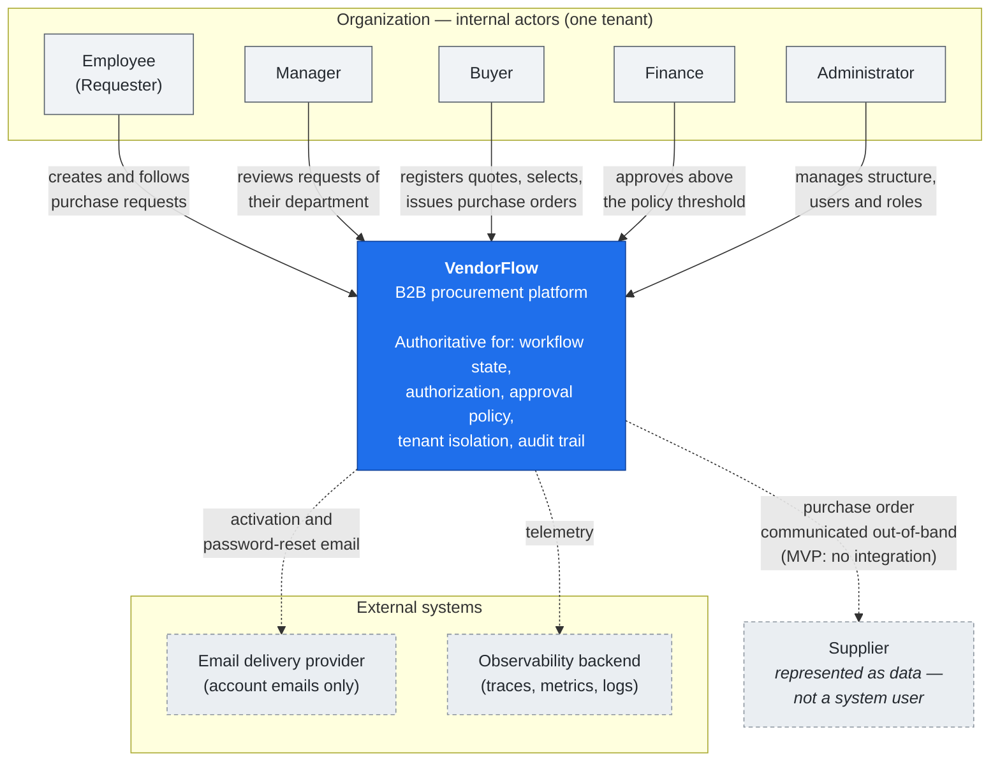
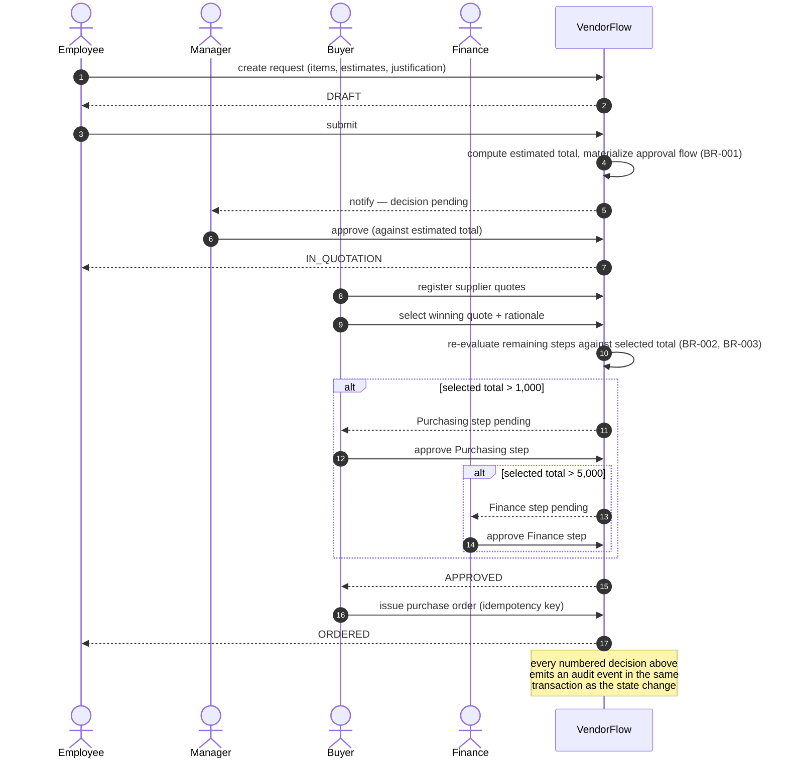

# VendorFlow — System Context

**Status:** Draft (Phase 0 — Product Discovery)
**Last updated:** 2026-08-30
**Scope:** C4 Level 1 (System Context). Container and component views are deliberately out
of scope at this phase.

---

## 1. System Purpose

VendorFlow is the **authority for the procurement decision process** of an organization. It
owns the lifecycle of a purchase request from the moment a need is stated until a purchase
order is issued, and it owns the record of every decision made along the way.

Everything the system does reduces to four responsibilities:

1. **Decide who may do what** — authorization within a tenant, a boundary and a state.
2. **Advance the workflow legally** — only defined transitions, only by the entitled actor.
3. **Enforce the approval policy** — the monetary ladder is a system rule, not a convention.
4. **Record what happened** — durably, in order, and without the ability to rewrite it.

Everything else — rendering, notifying, exporting — is peripheral to those four.

## 2. Actors

| Actor | Interacts by | Wants from the system |
| --- | --- | --- |
| Employee (Requester) | Web UI | State a need; know where it stands |
| Manager | Web UI | Review requests of their department; approve or reject |
| Buyer | Web UI | Register and compare quotes; select; issue the purchase order |
| Finance | Web UI | Approve high-value commitments against a real price |
| Administrator | Web UI | Maintain structure, users and roles for their organization |

All actors are **internal to one Organization**. There is no anonymous, public or
supplier-facing surface in the MVP: suppliers are records, not users (assumption A-8 in the
requirements). This is the single most consequential boundary decision at this level — it
keeps the entire system behind one authenticated, single-tenant-per-session perimeter.

## 3. System Boundary

**Inside the boundary — VendorFlow owns and is authoritative for:**

- Organizational structure: organizations, branches, departments
- Identities, credentials, sessions and role assignments
- Supplier registry
- Purchase requests and their items
- Approval flows, approval steps and approval decisions
- Supplier quotes, quote items and the selection outcome
- Purchase orders
- The audit trail
- Notifications

**Outside the boundary — VendorFlow does not own and must not become authoritative for:**

- Payments, invoices, accounting entries
- Inventory and stock levels
- Delivery, receipt and supplier performance after the order
- Supplier master data belonging to any external system
- The organization's corporate identity provider (not integrated in the MVP)

## 4. External Systems

At MVP, VendorFlow is close to self-contained. External dependencies are limited and each
one is present for a stated reason:

| External system | Direction | Why it exists | Authority |
| --- | --- | --- | --- |
| **Email delivery provider** | outbound | Account activation and password reset only. Business notifications are in-app (FR-063). | External; VendorFlow owns the intent to send, not the delivery |
| **Observability backend** | outbound | Traces, metrics and logs for operating the system | External; contains no business authority |
| **Browser / end-user device** | inbound | The only client | Untrusted (see § 5) |

Deliberately absent at MVP, and each one would be a new trust boundary requiring its own
decision: corporate SSO / identity provider, ERP or accounting system, supplier portal,
e-signature provider, object storage for attachments.

## 5. Trust Boundaries

```
  UNTRUSTED                    │  TRUSTED (VendorFlow)          │  EXTERNAL
                               │                                │
  Browser, end-user device     │  API boundary                  │  Email provider
  ─ user input                 │  ─ authenticates               │  Observability backend
  ─ client-side checks         │  ─ authorizes                  │
  ─ any value the client sends │  ─ enforces tenant scope       │
                               │  ─ validates every input       │
                               │  ─ owns all business decisions │
```

**TB-1 — Client ↔ API.** The primary boundary. Everything arriving from a browser is
untrusted, including values the UI itself computed. Totals, tenant identifiers, role claims,
permitted transitions and price arithmetic are all recomputed or re-derived server-side. A
client-side check exists only to avoid a pointless round trip; removing all of them must
change nothing about what the system permits.

**TB-2 — Tenant ↔ tenant.** A boundary *inside* the trusted zone, and the one most likely to
fail quietly. The tenant is derived from the authenticated principal and from nothing else.
The boundary is enforced at a single choke point in data access rather than restated in
every query, because a boundary re-implemented per call site is a boundary that will
eventually be forgotten at one call site.

**TB-3 — Application ↔ system of record.** The database is trusted, but the application's
database role is not omnipotent: it holds no privilege to update or delete audit records
(AUD-003). The constraint is enforced where it cannot be argued with.

**TB-4 — Application ↔ external providers.** Outbound only, best-effort, and never on the
critical path of a business decision. A degraded email provider or observability backend
must not prevent an approval from being recorded.

## 6. Context Diagram



The dashed edge to Supplier is intentional and important: the purchase order leaves the
system as a document a human sends. **No supplier-facing interface exists**, so the system
has no inbound path from outside the organization.

## 7. Major Information Flows

### 7.1 Primary flow — need to order



Two properties of this flow are architectural, not cosmetic:

- **The Manager decides on an estimate; Purchasing and Finance decide on a real price.**
  This is why the approval flow is re-evaluated after selection instead of being fixed at
  submission — and why it can be extended or partially voided (BR-003).
- **The state change and its audit event commit together** (AUD-004). This is the strongest
  reliability constraint at this level and it shapes every later decision about where the
  transaction boundary lives.

### 7.2 Secondary flow — side effects

A business decision commits its state change, its audit event and its **intent to produce
side effects** in one transaction. Notifications and any other downstream work are derived
from that committed intent afterwards, processed at-least-once by idempotent consumers, and
retried on failure (REL-002, REL-003, REL-006).

The reason is a correctness requirement, not a performance one: firing a notification inside
the transaction sends it for changes that then roll back, and firing it after the commit
loses it when the process dies in between. Neither failure is acceptable for actions this
system exists to make traceable.

## 8. Authoritative Data Ownership

Who owns a fact determines who may change it and who must be asked for it.

| Data | Owner | Notes |
| --- | --- | --- |
| Organizations, branches, departments | VendorFlow | System of record |
| Users, credentials, role assignments | VendorFlow | No external identity provider at MVP |
| Suppliers | VendorFlow | Owned per tenant; not shared, not imported |
| Purchase requests, items, state | VendorFlow | The core aggregate |
| Approval flows, steps, decisions | VendorFlow | Decisions are historical facts |
| Supplier quotes and selection | VendorFlow | Prices captured as recorded |
| Purchase orders | VendorFlow | Snapshot at issuance; independent thereafter |
| Audit trail | VendorFlow | Append-only; no external writer |
| Notification content and read state | VendorFlow | Delivery status of an email is not owned |
| Email delivery outcome | Email provider | VendorFlow owns the intent, not the outcome |
| Telemetry | Observability backend | Copy of operational data; no business authority |
| Payment, invoice, accounting, receipt | **Nobody — outside the boundary** | Must not be inferred or shadowed |

Two ownership rules constrain later design and are stated here so they cannot be eroded by
convenience:

- **The relational system of record is authoritative.** Any cache is a derived, disposable
  copy. A cached value must be reconstructable from the system of record at any moment, and
  a business decision must never be made from a cache that the system of record could
  contradict.
- **The audit trail is written by the domain, once, and never rewritten.** No maintenance
  path, no admin tool, and no migration may edit it (AUD-003).

## 9. Quality Attributes Driving Architecture

The architecturally significant requirements at this level, in priority order:

1. **Tenant isolation** (MT-001…MT-008) — a cross-tenant leak is a product-ending defect,
   not a bug. It outranks everything below it.
2. **Authorization correctness** (AUTHZ-001…AUTHZ-008) — role, boundary and state together,
   default deny.
3. **Transactional consistency of decision + audit** (REL-001, AUD-004).
4. **Reliable side effects** (REL-002…REL-006) — at-least-once, idempotent, retried,
   dead-lettered.
5. **Explainability** — the system is also a teaching artifact; a design that works but
   cannot be explained as Problem → Decision → Alternative → Trade-off is considered
   incomplete.

Performance (NFR-002) and scale (NFR-003) are real but **not** the dominant drivers at this
size. Design pressure at this stage comes from correctness and isolation, not throughput.
That ranking is the main justification for ADR-001.

## 10. Next Level

The container view — how the system is split into deployable units, and how those units talk
to the database and to each other — is decided in
[`docs/adr/ADR-001-modular-monolith.md`](../adr/ADR-001-modular-monolith.md).
